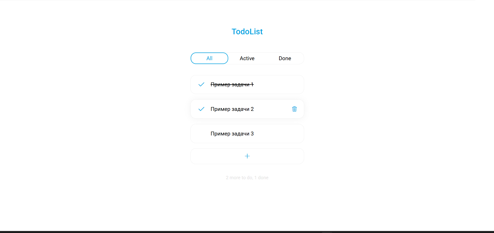
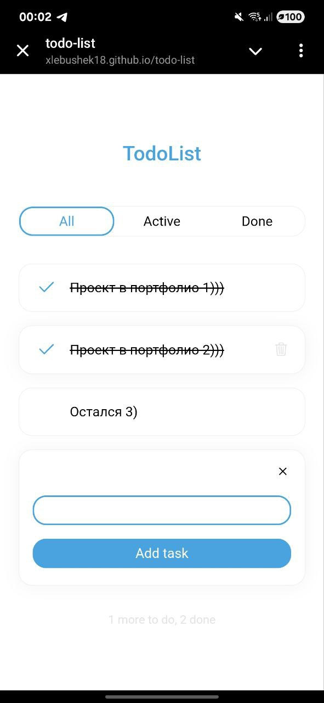

# Todo-list

# Планировщик задач — TodoList

Учебный проект на Vue 3 и TypeScript, демонстрирующий ключевые концепции фреймворка. [(Демонстрация проекта)](https://xlebushek18.github.io/todo-list/)

## 📋 О проекте

Этот проект — современный и отзывчивый планировщик задач, разработанный для глубокого изучения Vue 3 и его экосистемы. Основная цель — практическое применение TypeScript для обеспечения надежности кода.

## ✨ Функциональность

*   ✅ Добавление, редактирование и удаление задач
*   ✅ Отметка задач как выполненных
*   ✅ Фильтрация списка (Все/Активные/Завершенные)
*   ✅ Поиск по задачам в реальном времени
*   ✅ Сохранение данных в localStorage (задачи не пропадают после перезагрузки)
*   ✅ Адаптивный и чистый UI

## Стек

- Vue 3 (API параметров)
- TypeScript
- HTML
- CSS
- Vue CLI

## 📸 Скриншоты

### Основной интерфейс


### Мобильная версия


## Project setup
```
npm install
```

### Compiles and hot-reloads for development
```
npm run serve
```

### Compiles and minifies for production
```
npm run build
```

### Lints and fixes files
```
npm run lint
```

### Customize configuration
See [Configuration Reference](https://cli.vuejs.org/config/).
